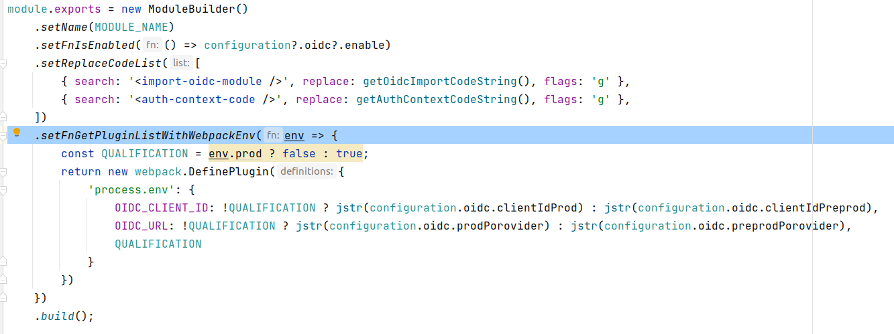

# Dydu private Module Managment

*last update: 04/02/2022*

## The private module managment problem
### Basics
Let's say you have a npm module named `lizard` in which you use a module from your private npm registry.\
In the above screenshot taken from the `lizard` package.json, `voice-module` and `oidc-module` are both private packages that have been
installed from `@dydu_ai` private registry.


As it's private, you will be prompt a login/password to install it.\
`npm login --registry https://<private-registry-url>` to login.\
`npm logout --registry https://<private-registry-url>` to logout.\
`npm whoami` to check if you are logged in

### Source of problem
There is nothing bad having a private registry to store all packages we want: we have the correct credential to `npm install` them.

But if you think about sharing your `lizard` module to the open source world, you will have to face the problem of: \
How can the world run `npm install` on your `lizard`, without credential to access your private registry ?

## The proposed solution
The proposed solution in here is to remove private packages away from the `package.json` so that every body will not get credential error when they will `npm install`.

Instead, we can dynamically install those private packages, on npm scripts (start|build|...) based on a configuration file wich enable/disable the use of the private module.

Having a `package.json` without any private package, I can enable, say, the `voice-module` from a `configuration.json` file. \


Below, I'm ensuring that I'm not logged in, running `npm whoami` instruction.\


Then I can call `npm start` and see there is message telling us the installation of `voice-module`.


## How to dynamically install a Dydu private module
This is a suggested solution.

### A module
In this solution a module is nothing more than a object that contains informations about it and what it needs to be properly installed.
* `name: string`, the module name **required**
* `isEnabled(): bool`, a boolean function that can be called to check if the module is enabled or not **required**
* `getPluginListWithWebpackEnv(): []`, a function that returns a list of necessary webpack plugin for the module to be installed properly.\
* `getRuleListWithWebpackEnv(): []`, a function that returns a list of necessary webpack loaders (or rules) for the module to be installed properly.\
* `replaceCodeList: []`, a list of search replace code, where an item of that list has the below shape. **required**
```javascript
{
    flags?: 'g',
    search: '',
    replace: ''
}
```
What is the purpose of the last property will be discuss later.

### Create the module File
#### Where


At the root project there is a directory named `dydu-module`.\
Each module should have it specific directory inside `dydu-module/module`.\ In the above screenshot we can see two modules: `oidc` and `voice`.

#### Code to create a module.
For sample, here is the content of the `VoiceModule.js` file.


We now can talk about the `replaceCodeList` property.\
Take a look on the above schema.


There are components that use (import) module api (here, VoiceApi is a module api). \
A module api is the place where we import the private corresponding package.

As a module can have the state of `{enable: true}` *or* `{enable: false}`, we soon have to face the problem of import a module that have not been installed (mean a disabled module).
In that case, we will get an error running webpack. It will tell us that the package we want to import is missing in dependencies.

To solve that, we have to *inject the code of importation*.

Here is the VoiceApi.js file content.


The `Voice` component instanciation *line 9* is the private component that we **try** to use.
As it component can be or can not be installed - as we said, depending on a configuration - the block `try` can throw an error.\
If it is throwing error, we know that the private `Voice` module has not been enabled, so we catch the error and return a `null`.

So that, `VoiceModule` can either be an instance of `<Voice />` component (coming from your private registry) if it has been enabled in configuration, or null if it has been disabled.

The *line 15* add a static value for the field |isEnabled| and this can be use to check enability, when, in the project we want to use VoiceModule.


The *line 3* is where `replaceCodeList` join the game.


### Use ModuleBuilder tool
The ModuleBuilder is a tool with fluid API that will help to create a module.

### Add your module to ModuleList.js


### Create the module Api File
The module Api File is the entry point of your private component in the project that return your component or a shallow version of you component or null.
This file is the one imported in the project, juste like we saw earlier for Voice module.

This file is placed in a directory that is under `src/`.


### Inject the module code in the project
From the point of view of the project code, the module api file is seen as a *normal* component and thus it can be inject simply as a regular component, just as we saw for the voice module.

## Behind the scene
### Overview of webpack
Briefly, webpack will list all files within a project.\
It will pass each file, one by one, to a loaders list (rules) that will apply *transformation* on that file if it matches the test.
Then, when it finishes the file parsing, webpack will call it list of plugins.

#### Loaders
Here is a example of a simple loader.


If the file webpack give to it loader matches the `test` regex (the filename ends with .css) then, webpack will call something like `styleLoader(cssLoader(fileWithCssExtension))`.

There are plenty of loaders available for webpack, and to solve our problem here, we use one of those loader called `string-replace-loader`.

As it well named, `string-replace-loader` will apply a search/replace transformation on the file webpack give it.

The `replaceCodeList` will feed `string-replace-loader`.


#### Plugins
Plugins are called at the end of webpack processing file step and then will call each of it Plugin, wich is a list.

Here is a sample webpack configuration file.


As your private component could need some plugin, the `ModuleBuilder` can give you the chance to inject plugins.

Here is the oidc module that inject some needed plugins.


If you want further informations about the injection of those loader/plugin, please check the `ModuleList.js` code.